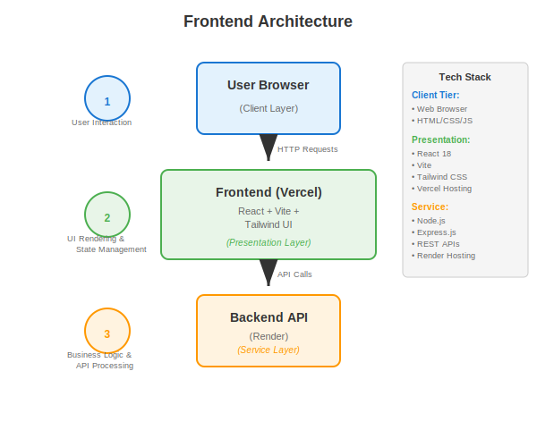
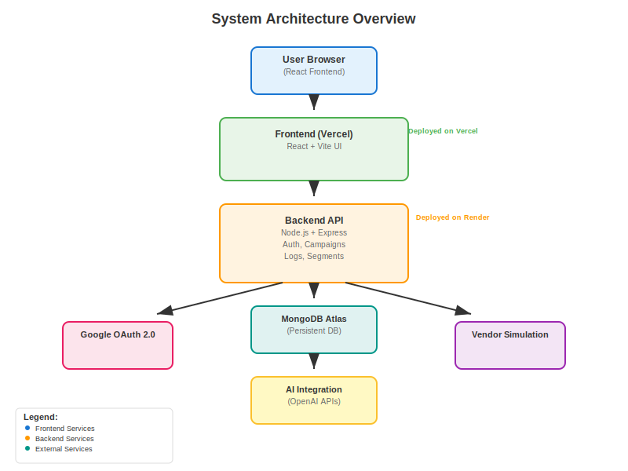

# Xeno CRM - Frontend

This is the frontend for the Xeno CRM platform, a modern, responsive single-page application (SPA) built with React and TypeScript.

## Local Setup Instructions

### Prerequisites

* Node.js (v18 or later recommended)
* npm or yarn

### Installation & Setup

1.  **Clone the repository:**

    ```bash
    git clone <your-repository-url>
    cd <repository-name>/frontend
    ```

2.  **Install dependencies:**

    ```bash
    npm install
    ```

3.  **Configure environment variables:**
    If your backend is running on a different URL than `http://localhost:4000`, create a `.env.local` file in the `frontend` directory and add the following line:

    ```
    VITE_API_BASE=http://your-backend-url
    ```

4.  **Run the development server:**

    ```bash
    npm run dev
    ```

    The development server will start on `http://localhost:8080` and open the application in your default browser.

## Architecture Diagram

#### Backend Architecture


#### Combined Architecture



## Summary of AI & Tech Used

### Core Technology Stack

* **React & TypeScript:** The core library for building the user interface, with TypeScript for static type-checking.
* **Vite:** A next-generation frontend tooling that provides a faster and leaner development experience.
* **React Router DOM:** Used for declarative, client-side routing within the single-page application.
* **Tailwind CSS & Shadcn UI:** Provides a utility-first CSS framework and a set of beautifully designed, reusable UI components, allowing for rapid and consistent UI development.
* **Axios:** A promise-based HTTP client for making requests to the backend REST API.
* **React Context API:** Used for managing global state, specifically for user authentication (`AuthContext`).
* **Recharts:** A composable charting library built on React components, used for data visualization in the Analytics dashboard.

### AI Tools & Integration

The frontend does not contain any AI models itself but provides the user interface to interact with the AI-powered features of the backend.

* **AI Rule Builder UI:** A text area that captures the user's natural language prompt for customer segmentation.
* **AI Message Suggestion UI:** Inputs for product, audience, and tone that are sent to the backend to generate campaign messages.

## Known Limitations & Assumptions

* **No Frontend-Specific Tests:** The project currently lacks a dedicated testing suite for the frontend components (e.g., using Jest and React Testing Library).
* **Simple State Management:** Global state is managed with the Context API. For a much larger application, a more robust solution like Redux or Zustand might be necessary to handle more complex state interactions.
* **Limited Form Validation:** Client-side form validation is minimal and relies heavily on backend validation.
* **Accessibility (a11y):** While Shadcn UI provides a good baseline, a full accessibility audit has not been performed, and there may be areas for improvement.